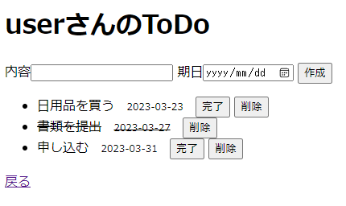
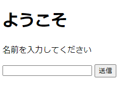

# TODOAPP

TODOAPP

## 概要

内容と期日を入力することによりタスクを管理できる、シンプルなWEBアプリケーションです。  
データベースと連携しており、ユーザーごとに個人のタスクを管理することができます。

## 使い方

ユーザー入力ページでユーザー名を入力すると、個人のタスクを表示したメインページに遷移します。  
「内容」「期日」を入力して「作成」をクリックすると、タスクが作成されます。  
「戻る」を選択すると、ユーザー入力ページに戻ります。
  
### 完了

対象のタスクに取り消し線が引かれます。  

### 削除

対象のタスクを一覧から削除します。

## 使用言語、環境
- Java 17
- Tomcat 9
- Eclipse 2022-12 (4.26.0)
- MySQL 8.0.32 MySQL Community Server - GPL

## データベース構成

このプロジェクトでは、MySQLを使用しています。以下は、データベース内のテーブル構成です。  
データベース名：todoapp_db

### todo_user

| Column | Type | Options |
| ------ | ---- | ------- |
| user_id | integer AUTO_INCREMENT | PRIMARY KEY |
| user_name | varchar(10) |  |

### todo

| Column | Type | Options |
| ------ | ---- | ------- |
| task_id | integer AUTO_INCREMENT | PRIMARY KEY |
| user_id | integer | REFERENCES todo_user(user_id) |
| task | varchar(100) |  |
| task_date | date |  |
| done | boolean | DEFAULT 0 |
